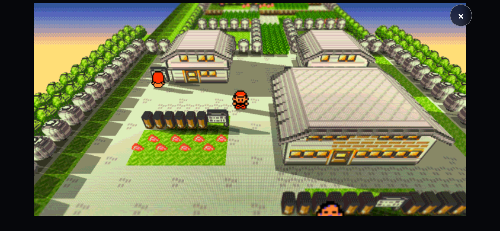
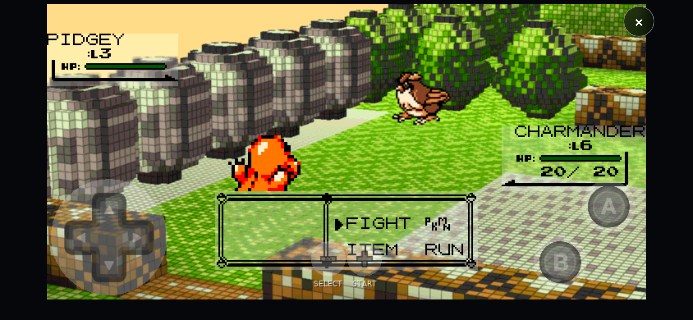
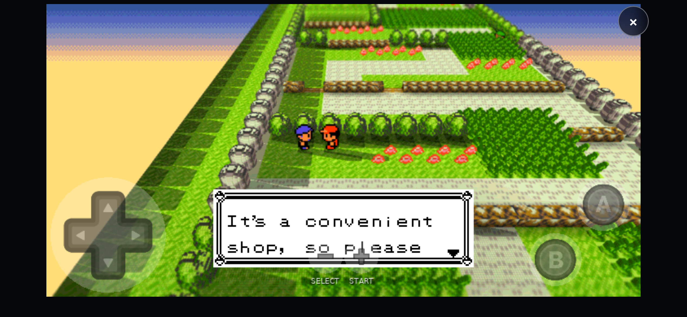

# Gen1Recomp Web / PWA

[English](README.md) | **Français**

Jouez à Gen1Recomp dans le navigateur de votre téléphone, avec votre propre ROM. Pas d'émulateur, pas de sideloading, pas d'App Store.

**Version actuelle : v2.0** — voir [`docs/BASELINE-v2.0.md`](docs/BASELINE-v2.0.md).

<p align="center">
  
  
  
  
  
  
  
  
</p>

<p align="center">
  
</p>

<p align="center">
  <a href="https://gen1recomp.inlasco.fr/"></a><br>
  <sub>S'ouvre directement dans votre navigateur mobile. Aucun téléchargement, aucun App Store, aucun compte GitHub.</sub>
</p>

> [!WARNING]
> ## ⚠️ Utilisez le mod fourni dans ce dépôt
>
> La version standard, en amont, de Dramatic Shape **n'est pas** la version Web/mobile adaptée utilisée par ce projet. Pour la configuration prise en charge, téléchargez et importez exactement ce fichier :
>
> ### 👉 [`mods/DramaticShape-Mobile-Web-by-inlasco.zip`](mods/DramaticShape-Mobile-Web-by-inlasco.zip)
>
> Un ZIP de Dramatic Shape récupéré ailleurs peut provoquer : fonctionnalités absentes, problèmes de rendu, mauvais comportement widescreen, problèmes de `G-SHADOW` et diverses incompatibilités. La plupart des retours « ça ne marche pas » viennent en réalité d'une autre version du mod, et non d'un bug de ce portage.
>
> **Avant de signaler un bug du port Web/PWA, reproduisez le problème avec le mod fourni dans ce dépôt.**

<p align="center">
  <strong>Soutenir le projet</strong><br>
  <sub>Le projet vous plaît ? Si vous souhaitez soutenir la poursuite du développement et des tests du port Web/PWA, vous pouvez faire un petit don PayPal à <strong>inlasco</strong>. Chaque contribution aide le projet.</sub>
</p>

<p align="center">
  <a href="https://www.paypal.com/qrcodes/p2pqrc/3SUFQM7Z3MG6L">
    
  </a><br>
  <strong><a href="https://www.paypal.com/qrcodes/p2pqrc/3SUFQM7Z3MG6L">Faire un don via PayPal</a></strong>
</p>

> [!IMPORTANT]
> **Aucune ROM n'est incluse.** Vous fournissez la vôtre, obtenue légalement et prise en charge. Elle est lue localement sur votre appareil et n'est jamais envoyée vers ce dépôt ni vers le serveur d'hébergement.

> [!TIP]
> **Les ROM françaises originales sont désormais prises en charge.**
> Les versions françaises commerciales originales et non modifiées de **Pokémon Version Rouge**, **Pokémon Version Bleue** et **Pokémon Version Jaune — Édition Spéciale Pikachu** sont prises en charge, en plus des versions US originales de Red, Blue et Yellow. Les dialogues, les noms de Pokémon et d'attaques, les objets et les entrées du Pokédex proviennent tous de votre propre cartouche française.
>
> Un seul dump canonique par jeu et par région est reconnu — voir [ROM originales prises en charge](#rom-originales-prises-en-charge). Les ROM patchées, hackées, fan-traduites ou autrement modifiées ne font pas partie de la baseline prise en charge et sont refusées par l'importeur.

---

## 🎥 Tutoriel vidéo

Besoin d'un guide rapide ? Cette vidéo montre comment lancer le jeu et activer les options 3D recommandées, de bout en bout.

<p align="center">
  <a href="https://streamable.com/jl08os"></a>
</p>

**▶ [Voir le tutoriel Gen1Recomp Web/PWA](https://streamable.com/jl08os)** — <https://streamable.com/jl08os>

## Jouer en 4 étapes

Aucun compte GitHub n'est nécessaire. Vous n'avez pas besoin de télécharger ni de compiler ce dépôt.

1. **Ouvrir l'application Web**  
   Ouvrez **[gen1recomp.inlasco.fr](https://gen1recomp.inlasco.fr/)** et attendez l'apparition du launcher.

2. **Choisir sa ROM**  
   Touchez `Import ROM`. Un bandeau plein écran apparaît — touchez-le, et le sélecteur de fichiers de votre appareil s'ouvre. Choisissez votre propre ROM originale de Rouge / Bleue / Jaune, obtenue légalement, en version US ou française. L'extraction prend une quinzaine de secondes. **La ROM reste sur votre appareil.**

3. **Activer Dramatic Shape pour le rendu 3D**  
   Téléchargez [`mods/DramaticShape-Mobile-Web-by-inlasco.zip`](mods/DramaticShape-Mobile-Web-by-inlasco.zip) depuis ce dépôt. Dans l'application Web, ouvrez l'onglet `MODS`, touchez `Import mod .zip`, sélectionnez le ZIP, puis activez **Dramatic Shape Voxel Mod**.  
   **N'utilisez pas un autre ZIP de Dramatic Shape : cette adaptation Web/mobile est la version prise en charge par ce projet.**

4. **Appliquer les réglages 3D recommandés et jouer**  
   En jeu, appuyez sur `START` → `OPTION`, appliquez les réglages ci-dessous, puis jouez avec les commandes tactiles ou une manette connectée.

**Ce qu'il vous faut :** un iPhone / iPad ou un appareil Android récent, et votre propre ROM `.gb` / `.gbc` de très exactement 1 Mio, obtenue légalement. Une manette est facultative et détectée automatiquement.

## ROM originales prises en charge

| Jeu | Version US originale | Version française originale |
| --- | --- | --- |
| Pokémon Red / Version Rouge | ✅ | ✅ **Pokémon Version Rouge** |
| Pokémon Blue / Version Bleue | ✅ | ✅ **Pokémon Version Bleue** |
| Pokémon Yellow / Version Jaune | ✅ | ✅ **Pokémon Version Jaune — Édition Spéciale Pikachu** |

L'importeur identifie votre ROM par son empreinte SHA-1 et accepte **un seul dump canonique par jeu et par région** — six au total. Tout le reste, y compris les fichiers patchés, hackés, fan-traduits, randomisés, surdumpés ou tronqués, est refusé par conception : l'importeur lit votre cartouche à des adresses précises, et un dump modifié produirait un jeu cassé plutôt qu'une erreur honnête.

Chaque jeu conserve ses imports US et français côte à côte, dans des espaces séparés, avec des sauvegardes séparées. Importer Rouge ne perturbe pas un Red existant.

<details>
<summary><strong>Les dumps exacts acceptés par l'importeur (SHA-1)</strong></summary>

| Jeu | Région | SHA-1 |
| --- | --- | --- |
| Pokémon Red | US | `ea9bcae617fdf159b045185467ae58b2e4a48b9a` |
| Pokémon Version Rouge | FR | `47a7622fa30e6402a3891fe65b3a930bf9bd7aec` |
| Pokémon Blue | US | `d7037c83e1ae5b39bde3c30787637ba1d4c48ce2` |
| Pokémon Version Bleue | FR | `47faa910d0e073c600665bf9c83b6bd17babdf8a` |
| Pokémon Yellow | US | `cc7d03262ebfaf2f06772c1a480c7d9d5f4a38e1` |
| Pokémon Version Jaune | FR | `0aceec0ef7aa2ca5aa831554598d91f61a925591` |

Ce sont les dumps commerciaux canoniques. La taille et l'en-tête ne sont que des contrôles secondaires ; c'est le SHA-1 qui décide.

</details>

**Aucune ROM n'est fournie, hébergée ni liée par ce projet.**

## Réglages 3D recommandés

Pour un rendu proche des captures de cette page. En jeu, `START` → `OPTION` ; une fois Dramatic Shape activé, ses lignes apparaissent en bas de cette liste.

| Réglage | Valeur | Pourquoi |
| --- | --- | --- |
| `PERFORMANCE` | `HIGH` | le profil mobile testé |
| `VOXEL` | `50` | l'angle de caméra de la vue 3D voxel |
| `3D-BTL` | `ON` | combats mis en scène sur la carte plutôt que sur l'écran plat |
| `BACK SPRITES` | `ON` | conserve le cadrage du sprite de dos de votre Pokémon |
| `DAYTIME` | `GOLDEN` | fige l'horloge sur la lumière dorée des captures ci-dessus |
| `G-SHADOW` | `ON` | les ombres géométriques validées |
| `WATER` | `FULL` | eau complète, reflets de rive compris |
| `AA` | `OFF` | conserve le rendu pixel art net |

<details>
<summary><strong>Preset testé complet</strong></summary>

| Réglage | Valeur |
| --- | --- |
| `MUSIC FILTER` | `OFF` |
| `PERFORMANCE` | `HIGH` |
| `COLORS` | `ADVANCED` |
| `TILT` | `OFF` |
| `VOXEL` | `50` |
| `T-SHIFT` | `1` |
| `V-GRID` | `ON` |
| `V-CURVE` | `OFF` |
| `WATER` | `FULL` |
| `3D-BTL` | `ON` |
| `BACK SPRITES` | `ON` |
| `DAYTIME` | `GOLDEN` |
| `G-SHADOW` | `ON` |
| `AA` | `OFF` |

Laissez les autres options telles quelles, sauf si vous voulez les personnaliser. `Haut` / `Bas` déplacent le curseur, `Gauche` / `Droite` changent une valeur, `B` ou `START` revient au jeu.

Ce preset vient d'un usage mobile validé sur matériel. Ce n'est pas une configuration officielle de Dramatic Shape, et ce n'est pas une promesse de fluidité sur tous les appareils — si le vôtre peine, baissez les options de rendu avant de conclure que le port Web dysfonctionne.

</details>

## L'installer comme une application

**iPhone / iPad :** ouvrez l'application Web dans Safari → Partager → Sur l'écran d'accueil.

**Android :** ouvrez l'application Web dans un navigateur compatible → menu du navigateur → Installer l'application / Ajouter à l'écran d'accueil.

Une fois installée, elle fonctionne aussi hors ligne, et elle se met à jour toute seule : une nouvelle version publiée sur le serveur est prise en compte au lancement suivant, sans rien à purger ni à réinstaller.

## Votre ROM et vos sauvegardes restent locales

> [!IMPORTANT]
> - La ROM que vous choisissez est lue et traitée **dans votre navigateur, sur votre appareil**. Ce port ne l'envoie ni vers ce dépôt ni vers le serveur d'hébergement.
> - Les données générées, les réglages et les sauvegardes vivent dans le stockage local de votre navigateur, séparément pour chaque jeu et chaque région.
> - **Effacer les données du site dans votre navigateur supprime vos sauvegardes locales.** Il n'existe aucune copie côté serveur.
> - Aucune ROM n'est fournie, distribuée ni liée par ce projet. Disposer d'une copie légale relève de votre responsabilité.

## Compatibilité

| Plateforme / Fonctionnalité | Statut |
| --- | --- |
| iPhone / Safari | ✅ Validé sur matériel |
| Android | ✅ Testé avec succès |
| ROM US originales — Red / Blue / Yellow | ✅ |
| ROM françaises originales — Rouge / Bleue / Jaune | ✅ |
| Commandes tactiles | ✅ |
| Manette de jeu | ✅ |
| PWA installable | ✅ |
| Import local de ROM | ✅ |
| Import local de mod | ✅ |
| 3D voxel Dramatic Shape | ✅ |
| WebGL1 | ✅ |

**iPhone / Safari** est la plateforme qui a fait l'objet de la campagne matérielle approfondie de cette baseline, depuis la campagne v1.0 d'origine jusqu'à la validation `G-SHADOW` de la v2.0. **Android** a été testé avec succès — ce n'est pas une garantie pour tous les appareils ni tous les navigateurs Android.

Les trois versions françaises ont chacune été importées via l'application Web puis jouées, en plus de la suite de tests régionaux automatisée.

## Aperçu du jeu

<table>
  <tr>
    <td width="50%" align="center" valign="top">
      
      <br><sub>Combat 3D voxel avec commandes tactiles</sub>
    </td>
    <td width="50%" align="center" valign="top">
      
      <br><sub>Monde voxel avec commandes tactiles mobiles</sub>
    </td>
  </tr>
</table>

## Fonctionnalités

**Dans le navigateur** — moteur LÖVE 11.5 / WebAssembly, WebGL1, import local de ROM, import local de mod, persistance locale au navigateur (IndexedDB), commandes tactiles, prise en charge des manettes, PWA installable et jouable hors ligne, viewport mobile adaptatif, rendu 2D Gen1 au format natif.

**Rendu / Dramatic Shape** — monde 3D voxel large, build Web/mobile de Dramatic Shape, fleurs animées, `DAYTIME = GOLDEN`, ombres géométriques `G-SHADOW`, `VOID FILL = TREES`, combats en 3D.

**Prise en charge régionale** — trois jeux logiques (Red, Blue, Yellow), chacun avec une variante US et une variante française. Les mods ciblent toujours le jeu et non la région : un mod écrit pour Red s'applique aussi à Rouge. Le texte de la cartouche est extrait de votre propre ROM à l'import ; les textes propres au portage disposent d'un catalogue français séparé.

## Dramatic Shape

Le dépôt inclut l'adaptation Web/mobile actuelle :

```text
mods/DramaticShape-Mobile-Web-by-inlasco.zip
```

Elle est basée sur **Dramatic Shape Voxel Mod** de **DramaticShape** — dépôt d'origine : <https://github.com/DramaticShape/DramaticShapeVoxelMod> — et comporte un travail d'adaptation Web/iPhone supplémentaire réalisé par **inlasco**. Ce projet n'est **pas** l'auteur du mod d'origine : l'attribution en amont et la licence MIT sont conservées à l'intérieur de l'archive, et le nom interne du mod, son identifiant, son manifeste et sa paternité sont inchangés. Seul le nom du fichier publié dans ce dépôt indique de quel build il s'agit.

C'est l'archive exacte utilisée pour la validation matérielle v2.0 ; son SHA-256 est documenté dans [`docs/BASELINE-v2.0.md`](docs/BASELINE-v2.0.md).

> [!WARNING]
> C'est la version contre laquelle ce portage est testé. Un ZIP de Dramatic Shape téléchargé ailleurs n'est pas l'adaptation Web/mobile et n'est pas pris en charge ici.

---

## Informations techniques

C'est une **application web statique** : servez la racine du dépôt en HTTPS en conservant l'arborescence.

Le shell charge actuellement :

```text
game-v13.4-fr.love
11.5/love.js
11.5/love.wasm
```

Le moteur est LÖVE 11.5 compilé en **WebAssembly** (`love.js` / `love.wasm`), avec un rendu **WebGL1**, le jeu étant livré sous forme d'archive `.love`. Les données générées à partir de la ROM, les options et les sauvegardes sont stockées localement par le navigateur via IndexedDB / IDBFS, dans un espace distinct par jeu et par région. Aucune synchronisation de sauvegarde côté serveur ne fait partie de la baseline actuelle.

Deux petits fichiers gèrent la publication :

- `boot-guard.js` vérifie la taille exacte de chaque paquet présent dans le cache IndexedDB du chargeur avant le démarrage du moteur, et supprime ce qui ne correspond pas. Sans lui, un téléchargement interrompu peut rester épinglé indéfiniment dans un navigateur.
- `sw.js` est le service worker : la page et les fichiers vivants sont récupérés réseau d'abord, le runtime figé est servi depuis le cache, et l'ensemble du cache est vidé au changement de version. C'est ce qui fait qu'une nouvelle version arrive dès le lancement suivant, et ce qui permet le jeu hors ligne.

`.htaccess` définit la politique de cache HTTP correspondante pour un hébergeur Apache, et `diagnostic.html` est une page autonome qui vérifie fichier par fichier ce que le serveur renvoie réellement.

Les empreintes de chaque fichier publié sont listées dans [`SHA256SUMS`](SHA256SUMS).

La baseline publique actuelle est la **v2.0** et est décrite dans [`docs/BASELINE-v2.0.md`](docs/BASELINE-v2.0.md).

> [!NOTE]
> [`docs/BASELINE-v1.0.md`](docs/BASELINE-v1.0.md) est un **document historique**. Il consigne la campagne matérielle v1.0 d'origine et les empreintes des artefacts de cette baseline, dont `game-v13.3-viewport-final.love` et le mod sous son ancien nom de fichier. Cette archive est toujours publiée ici et fonctionne toujours, mais ce n'est plus celle que le shell charge par défaut. Ce document est l'histoire de la v1.0, pas la description du build actuel.

### Implémentation régionale

La prise en charge régionale est documentée dans [`docs/fr-regional/`](docs/fr-regional/) : notes de conception, dossier de validation, et l'outillage reproductible qui génère un manifeste régional à partir d'un désassemblage français. Les manifestes eux-mêmes sont dans `tools/`, un par jeu et par région, chacun lié à l'empreinte exacte de la ROM dont il est issu. La suite de tests :

```sh
tools/tests/run_fr_regional_tests.sh
```

### G-SHADOW en v2.0

Jusqu'aux versions v1.x, `G-SHADOW` pouvait mettre plusieurs secondes à apparaître après une transition intérieur → extérieur, et activer l'option en extérieur ne prenait pas effet immédiatement. La v2.0 corrige les deux, et c'est ce correctif qui motive cette version :

- activer `G-SHADOW` alors qu'on est déjà dehors prend désormais effet immédiatement, parce que la carte réellement affichée est traitée comme un travail urgent au lieu d'attendre dans la file d'arrière-plan ;
- sortir d'un bâtiment amène à l'extérieur avec les ombres déjà présentes, parce que la destination extérieure anticipée est préchauffée depuis l'intérieur que le joueur est encore en train de traverser, sur le même budget borné que celui déjà utilisé par le mailleur de terrain.

Ces deux scénarios ont été validés sur matériel réel (iPhone / Safari / PWA) avant cette version. L'approche de rendu est inchangée : toujours des ombres géométriques en espace monde sur WebGL1 — pas de shadow map, pas de depth texture, pas de PCF, pas de readback GPU, pas de WebGL2.

`VOID FILL = TREES` conserve son comportement existant et peut encore mettre un moment à se remplir après certaines transitions.

## Origine du projet

Ce dépôt est une adaptation Web/PWA indépendante et **n'est pas le dépôt officiel de Gen1Recomp**. Nous ne sommes ni les auteurs de Gen1Recomp, ni ceux de Dramatic Shape, et ce projet n'est pas officiellement affilié aux projets d'origine.

- Gen1Recomp — <https://github.com/bryanthaboi/gen1recomp>
- Dramatic Shape Voxel Mod — <https://github.com/DramaticShape/DramaticShapeVoxelMod>
- Moteur LÖVE 11.5 / love.js — licence conservée sous [`11.5/license.txt`](11.5/license.txt)

Voir [`THIRD_PARTY_NOTICES.md`](THIRD_PARTY_NOTICES.md).

## ROM et marques

Aucune ROM n'est distribuée par ce dépôt. Il revient aux utilisateurs de fournir leur propre ROM compatible obtenue légalement.

Pokémon, Nintendo, Game Boy et les noms, marques et propriétés intellectuelles associés appartiennent à leurs détenteurs respectifs. Ce projet est non officiel et n'est ni affilié à, ni approuvé par Nintendo, The Pokémon Company ou Game Freak.

## Licence

Il n'existe **aucune licence globale** couvrant l'ensemble de ce dépôt. Chaque composant conserve sa licence et ses mentions d'origine. Voir [`THIRD_PARTY_NOTICES.md`](THIRD_PARTY_NOTICES.md) et les fichiers de licence livrés avec les composants concernés.
